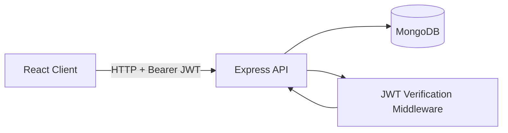

# MERN To-Do App


Production-style full-stack to-do application with JWT auth, protected routes, and user-scoped task management.

## Quick Start (60 Seconds)

```bash
# 1) Install dependencies
cd client && npm install
cd ../server && npm install

# 2) Configure environment
copy .env.example .env

# 3) Start API (terminal A)
npm run dev

# 4) Start web app (terminal B)
cd ../client && npm run dev
```

Open http://localhost:5173

## Table of Contents

1. Product Overview
2. Core Features
3. System Architecture
4. Tech Stack
5. Project Structure
6. API Reference
7. Data Model
8. Local Development
9. Environment Variables
10. Scripts
11. Security Practices
12. Deployment Notes
13. Troubleshooting

## Product Overview

This repository is structured as two independently deployable applications:

- `client`: React single-page application (Vite + Tailwind CSS)
- `server`: Express REST API with MongoDB via Mongoose

Each authenticated user can only access and mutate their own tasks. Server-side filtering by `req.userId` enforces this boundary.

## Core Features

- User registration with password hashing (`bcryptjs`)
- User login with JWT token issuance
- Protected route handling on the client
- Axios auth interceptor for automatic Bearer token propagation
- Task lifecycle operations:
- create
- list
- update completion/title
- delete
- Light/dark theme toggle with local preference persistence

## System Architecture



Authentication and request lifecycle:

1. User signs up or logs in via `/api/auth/*`.
2. API returns signed JWT (`expiresIn: 7d`).
3. Token is stored in browser local storage.
4. Axios interceptor injects `Authorization: Bearer <token>`.
5. Protected endpoints verify JWT and attach `req.userId`.
6. Task queries include user filter (`{ user: req.userId }`).

## Tech Stack

Client:

- React 18
- React Router 6
- Axios
- Vite 5
- Tailwind CSS 3

Server:

- Node.js (ESM)
- Express 4
- MongoDB + Mongoose
- jsonwebtoken
- bcryptjs
- dotenv
- morgan
- cors

## Project Structure

```text
.
|- client/
|  |- src/
|  |  |- api.js
|  |  |- App.jsx
|  |  |- components/
|  |  |- pages/
|  |- package.json
|
|- server/
|  |- src/
|  |  |- config.js
|  |  |- index.js
|  |  |- middleware/auth.js
|  |  |- models/
|  |  |- routes/
|  |- .env.example
|  |- package.json
|
|- .gitignore
|- README.md
```

## API Reference

Base URL: `http://localhost:4000/api`

### Auth

`POST /auth/register`

```json
{
        "email": "user@example.com",
        "password": "secret123"
}
```

`POST /auth/login`

```json
{
        "email": "user@example.com",
        "password": "secret123"
}
```

Typical auth response:

```json
{
        "token": "<jwt>",
        "user": {
                "id": "<userId>",
                "email": "user@example.com"
        }
}
```

`GET /auth/me` (protected)

- Header: `Authorization: Bearer <token>`

### Tasks (Protected)

`GET /tasks`

`POST /tasks`

```json
{
        "title": "Buy groceries"
}
```

`PATCH /tasks/:id`

```json
{
        "title": "Buy groceries and fruit",
        "completed": true
}
```

`DELETE /tasks/:id`

## Data Model

`User`

- `email`: string, unique, lowercased, trimmed
- `password`: hashed string
- `createdAt`, `updatedAt`

`Task`

- `user`: ObjectId reference to `User`
- `title`: string
- `completed`: boolean
- `createdAt`, `updatedAt`

## Local Development

Prerequisites:

- Node.js 18+
- npm 9+
- MongoDB Atlas or local MongoDB

1. Install client dependencies

```bash
cd client
npm install
```

2. Install server dependencies

```bash
cd ../server
npm install
```

3. Create local env file

```bash
copy .env.example .env
```

4. Set `MONGODB_URI` and `JWT_SECRET` in `.env`

5. Run API

```bash
npm run dev
```

6. Run client in a second terminal

```bash
cd ../client
npm run dev
```

7. Navigate to `http://localhost:5173`

## Environment Variables

Server `.env` variables:

- `PORT` (default `4000`)
- `MONGODB_URI`
- `JWT_SECRET`

Use [server/.env.example](server/.env.example) as the source of truth for required keys.

## Scripts

Client (`client/package.json`):

- `npm run dev` - start development server
- `npm run build` - create production build
- `npm run preview` - preview production build

Server (`server/package.json`):

- `npm run dev` - start API with nodemon
- `npm start` - start API with node

## Security Practices

- Never commit `.env` files.
- Keep only placeholders in `.env.example`.
- Rotate credentials immediately after any exposure event.
- Use strong random `JWT_SECRET` values in each environment.
- Restrict CORS origins for staging/production domains.
- Prefer HTTPS and managed secret storage in deployed environments.

## Deployment Notes

- Deploy client and server separately if needed.
- Update `client/src/api.js` base URL for non-local environments.
- Ensure MongoDB access controls are locked down to required IPs/services.
- Add reverse proxy, TLS termination, and logging/monitoring in production.

## Troubleshooting

Mongo connection errors:

- Verify `MONGODB_URI` format and credentials.
- Confirm database network rules allow your host.

401 Unauthorized responses:

- Ensure token exists in local storage.
- Ensure `Authorization` header is present and formatted as Bearer token.

CORS errors:

- Add your frontend origin to server CORS allowlist.

Port conflicts:

- Change `PORT` in `.env` or stop conflicting process.

---

This README is intentionally production-oriented and can evolve as features grow (screenshots, testing matrix, CI/CD, and release notes).